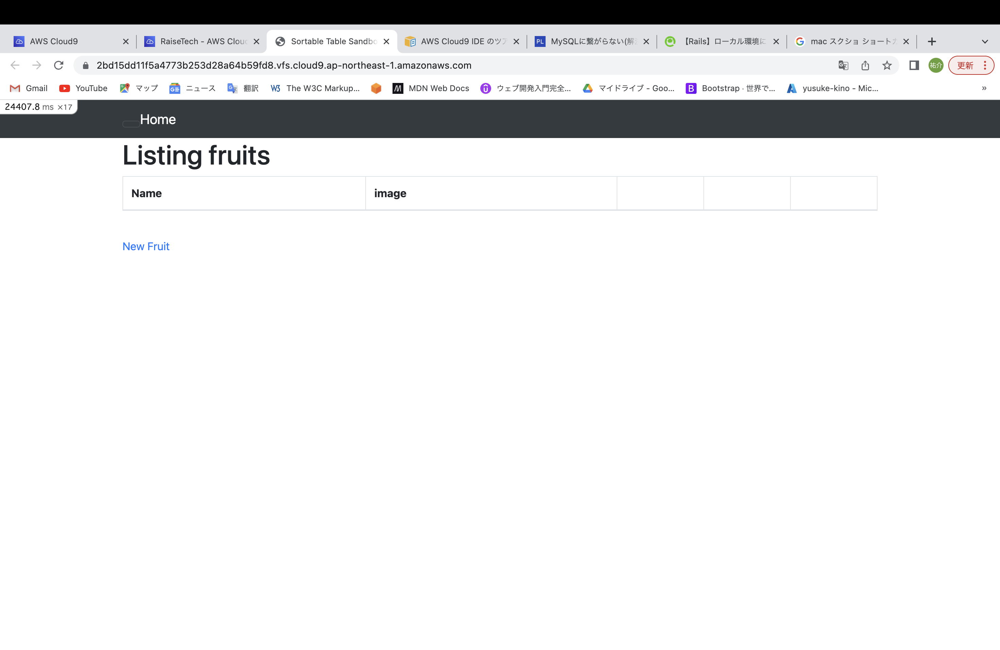
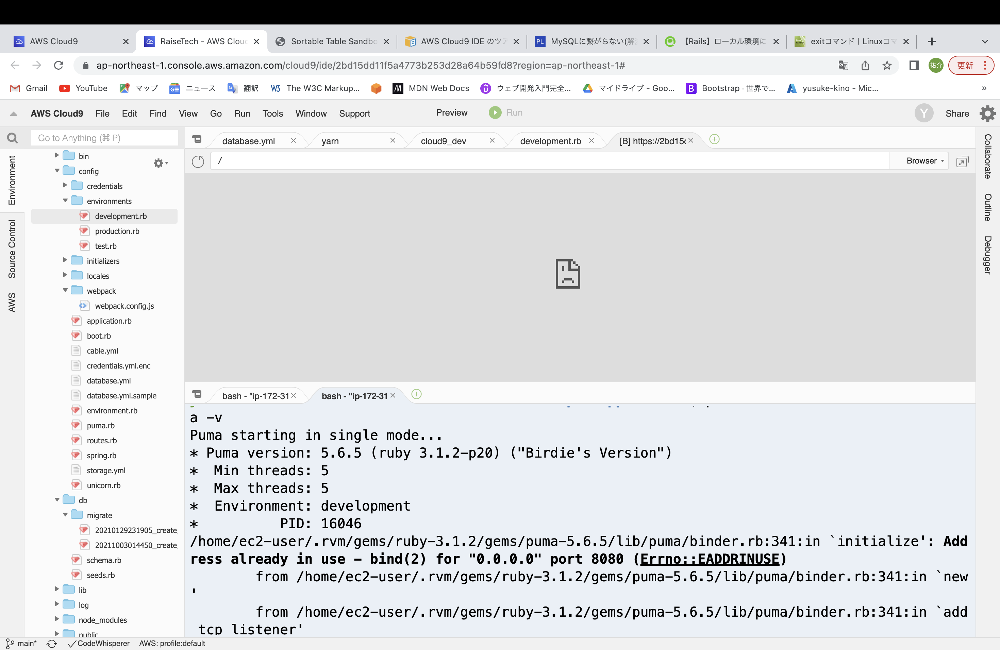
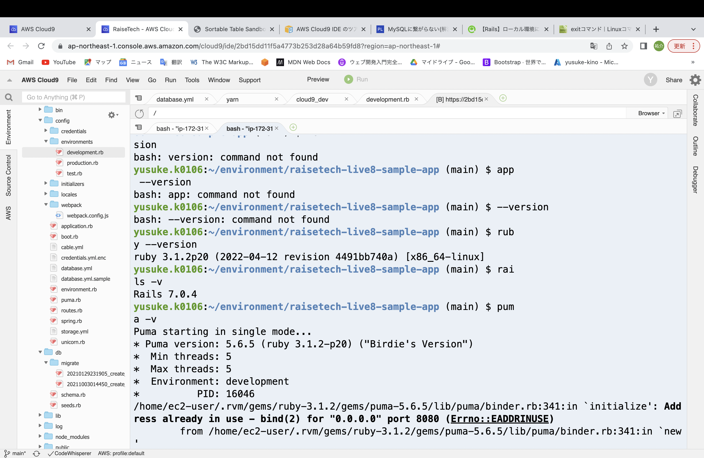
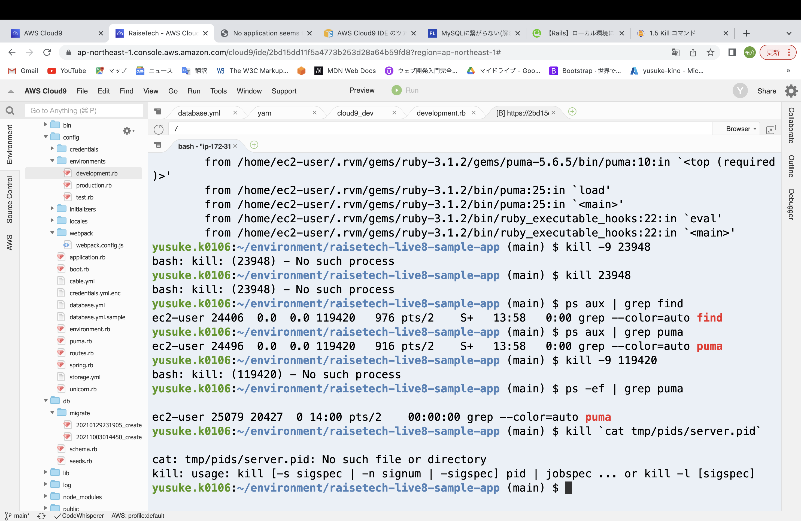
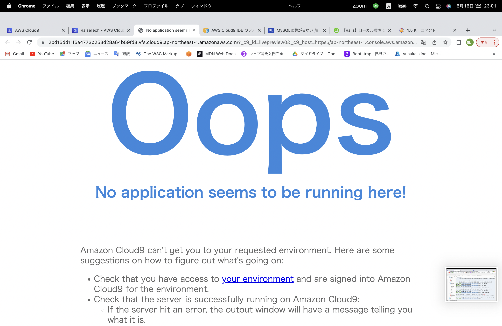
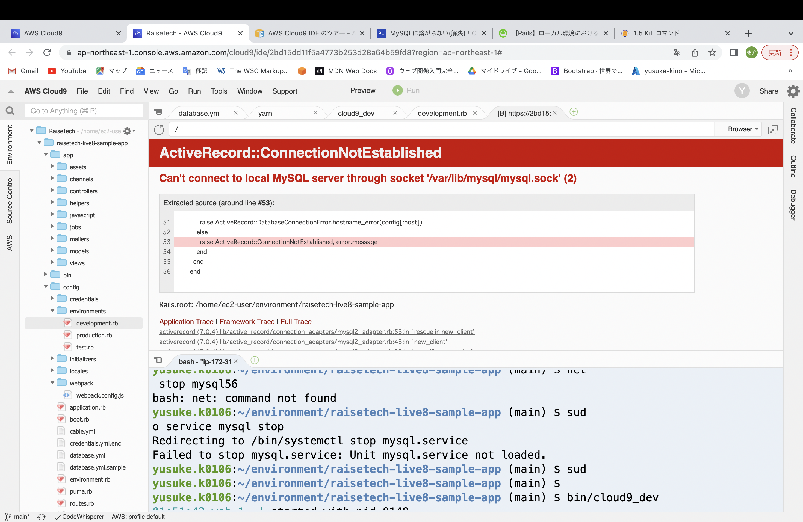

# 第3回課題
## 1.アプリケーションのデプロイ
-　cloud9を立ち上げ、GitHubからターミナルでサンプルアプリケーションを入手（git clone）
-　動画を手本にして、デプロイするための操作を行う

## 2.サーバーについて
- サーバーにはいくつか種類があるが、インストールしているミドルウェア（OSとアプリケーションの橋渡しをする役割）の種類によって、APサーバーやDBサーバーに分類される。　
- バックエンドのシステム構成において、web３層構成というものがある。
- 以前は、webサーバー・DBサーバーの２層構造が主流であったが、現在はwebサーバー・APサーバー・DBサーバーの３層構造が主流である。
- webサーバーとは、クライアントと直接やりとりするサーバーで、リクエストを受け取りその処理をAPサーバーに依頼し、返ってきた結果をクライアントに送る役割を持っている。
- webサーバーでは、静的な処理を実行することができるので、HTMLや画像ファイルなどの静的の処理はwebサーバーで対応可能である。

## 3.APサーバー
- APサーバーのバージョンについては、Puma version: 5.6.5 (ruby 3.1.2-p20) であった。
- APサーバーを終了させた場合、当然ながらアプリケーションにアクセスすることは出来なかった。

###　参考
- APサーバーは、webサーバーがクライアントから受け取ったリクエストを動的に処理し、結果を返却する役割を持っている。
- 動的な処理を行えるサーバーであり、受け取ったリクエストをプログラミング言語（例えばJava等）で作成されたアプリケーションを実行して、処理結果をwebサーバーへ返す。
- データアクセスが必要な場合は、APサーバーからDBサーバーにリクエストを送ることになる。
　
　

## 4. DBサーバー
-　DBサーバーのバージョンについては、mysql  Ver 8.0.33 for Linux on x86_64 (MySQL Community Server - GPL）であった。 
- MySQLコマンドは、
　*起動　sudo service mysqld start
　*状態確認　sudo service mysqld status
　*停止　sudo service mysqld stop
　*再起動　sudo service mysqld restart
　であった。
- DBサーバーを停止させると、エラーが起こりアプリケーションは起動できなかった。
### 参考
- DBサーバーは、APサーバーからのリクエストに応じて、データベースへの読み書きを行い、必要なデータをAPサーバーに返す役割を持っている。
- DBサーバーの読み書きを行う言語には、SQLがある。

## 5. 構成管理ツール
###　gem
- gemはRubyのパッケージとパッケージを管理するパッケージ管理システムの役割を持っている。
- 1.Rubyのパッケージ（ライブラリ）としてのgem
- パッケージとは、プログラムの部品で便利な機能をひとまとめにしたもので、使用することで１からコードを書くことなく機能を実装することができ、開発効率が向上する。
- 2.各gem（パッケージ）を管理するシステムであるRubyGemsを指して、「gem」とも呼ぶ
- パッケージ管理システムはgemパッケージのインストールや、アンインストールなどの操作に使用する。しかし、現在はRubyGemsでgem管理する機会が少なくなり、「bundler」というパッケージ管理ツールを使用することが多くなっている。     

### bundler
- bundlerとは、gemを管理するためのツールで、bundler自体もgemの一種である。bundlerを使用することで、複数のgemの依存関係を保ちながらgemの管理が出来る。
- gem同士はさまざまな依存関係にあり、管理するgemの数が増えるほど複雑になっていく。bundlerを使用することで、gem同士の依存関係を管理することができ、bundlerを使うことで依存関係にあるgemを一括インストールすることができる。

## 感想及び学んだこと（6月1７日）
- とにかくアプリケーションをデプロイするために、動画を何度も観ながら操作し、行き詰まれば何度も検索して、なんとかデプロイすることが出来た。
- デプロイ直後は、なんとなくしかわかっていなかったが、課題にある調べ物をしたり、APサーバー等をダウンさせることによって、理解が深まり知識として定着した。

### 学んだこと
1.フロントエンド（クライアント）からバックエンドである各サーバー間の役割、関係性　
2.アプリケーションデプロイ時にはプログラミングを理解しているだけでなく、裏側でシステム同士が正常に作用して初めて、アプリケーションとして成立すること
3.分からないことでも、ネット検索すれば大抵のことは時間はかかるが自力で解決出来ること

