# VPCの設定
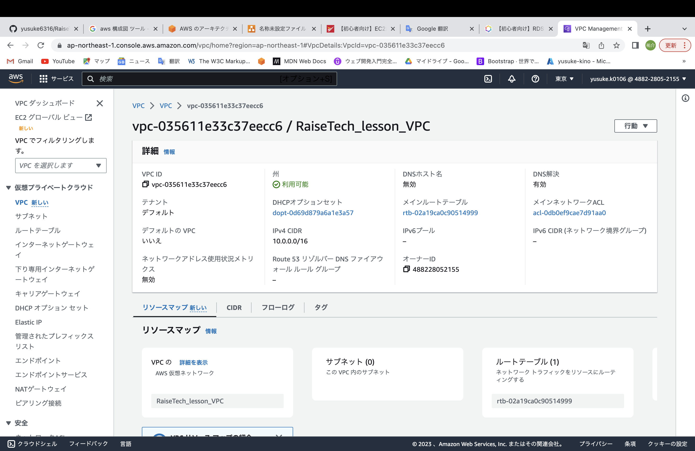

# パブリックサブネットの設定
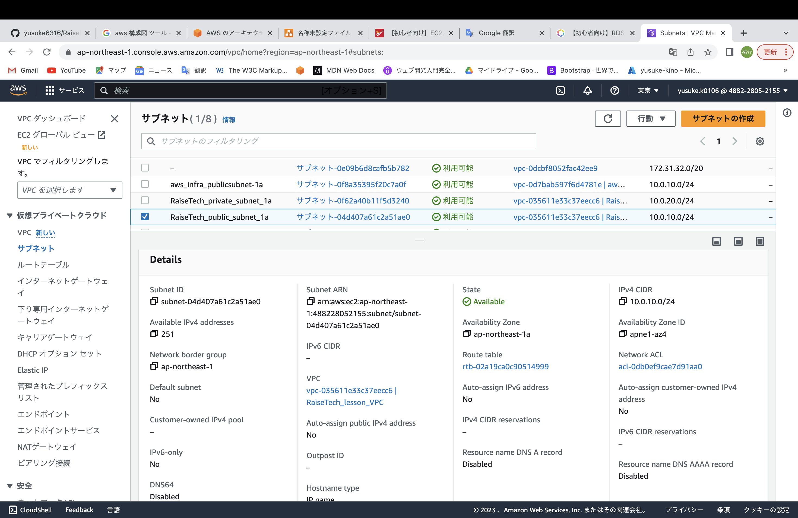

# プライベートサブネットの設定
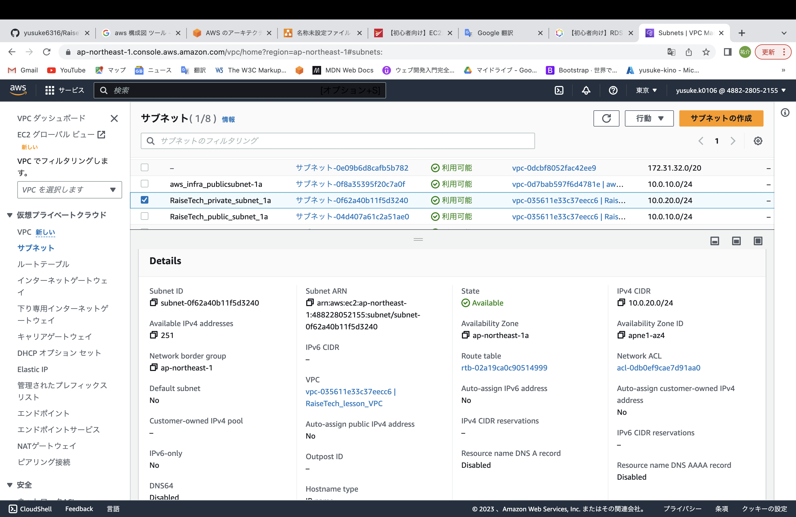

# インターネットゲートウェイの設定
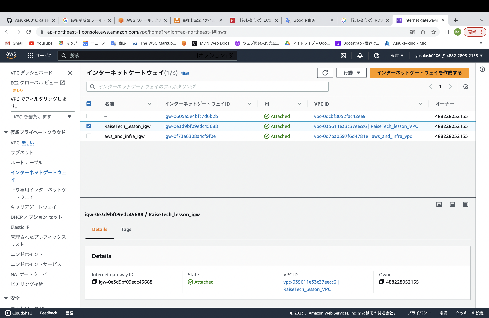

# EC2インスタンスへのSSH接続確認画面
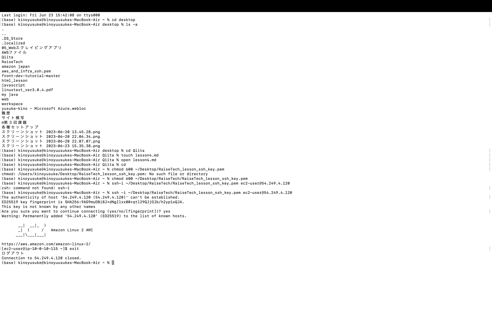

# apacheのインストール画面
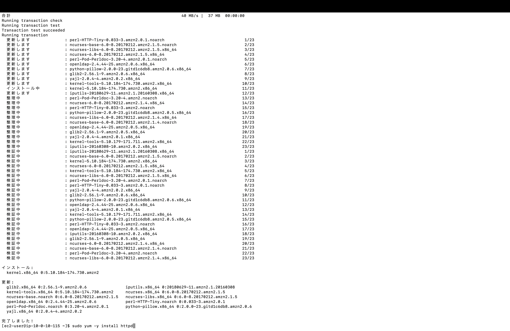

# apacheが正常に動作しているかの確認画面
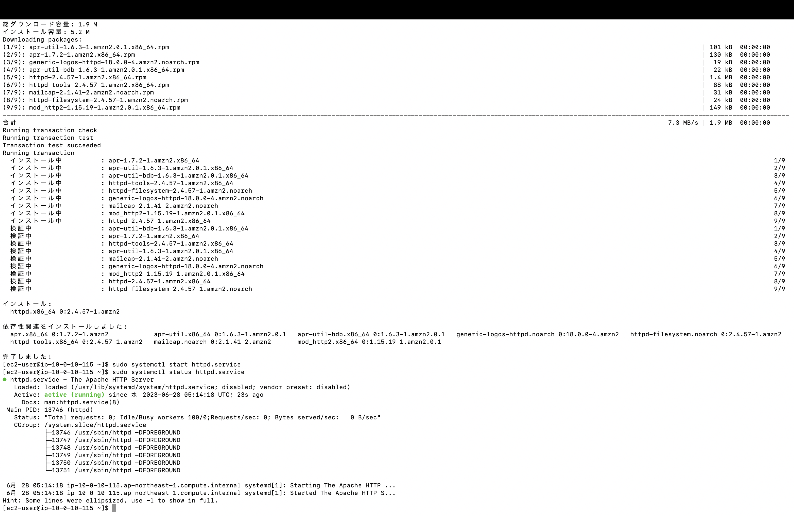

# yumのupdate画面
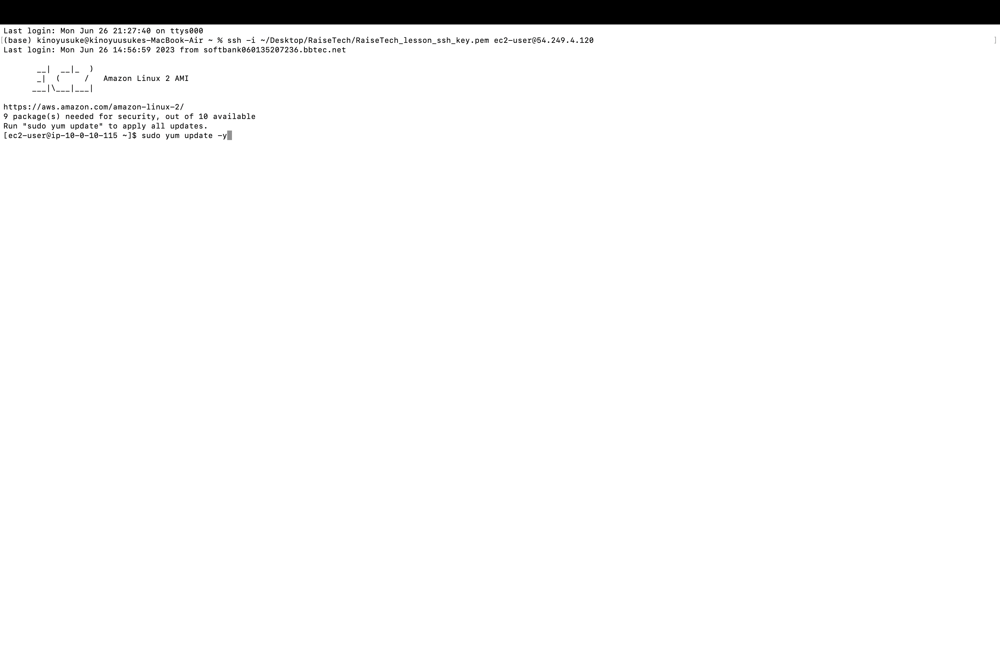

# apacheの自動起動設定画面
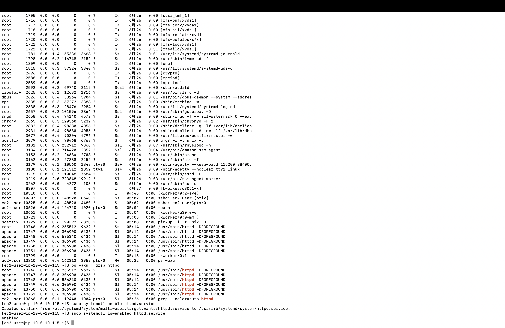

# RDS作成画面
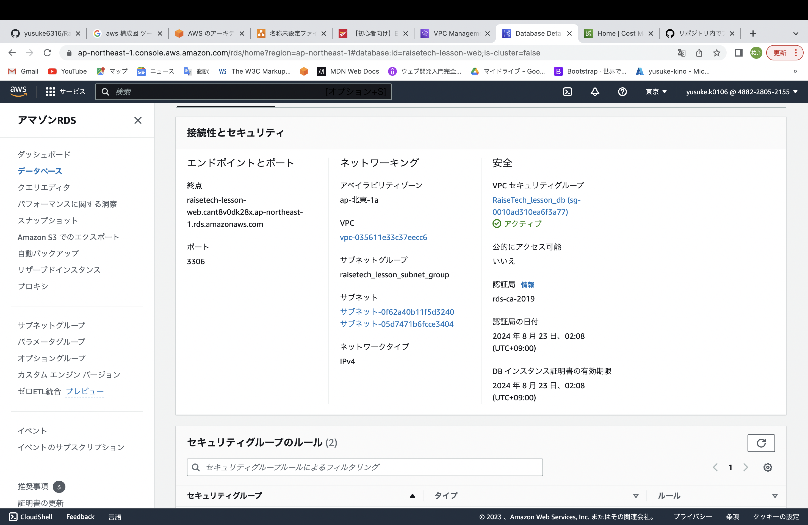

# RDSのセキュリティグループの設定画面
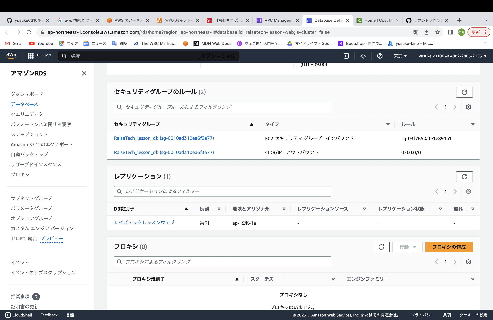

# RDS作成後のルートテーブル
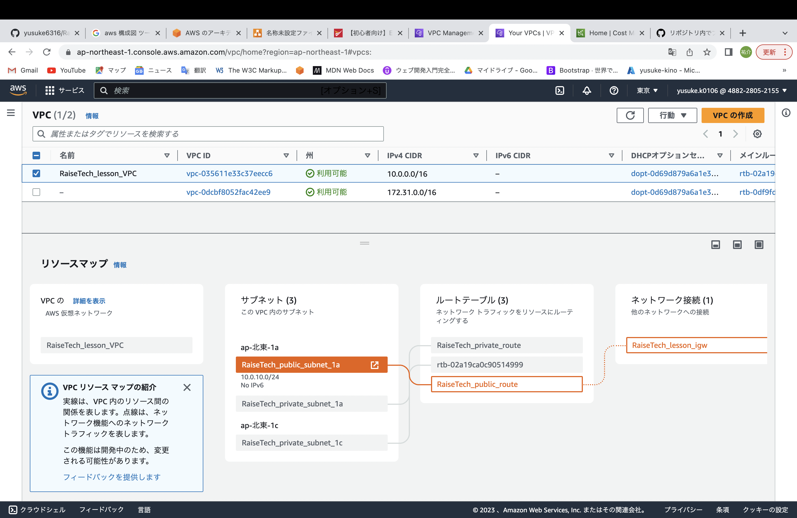

# EC2からRDSへの接続画面
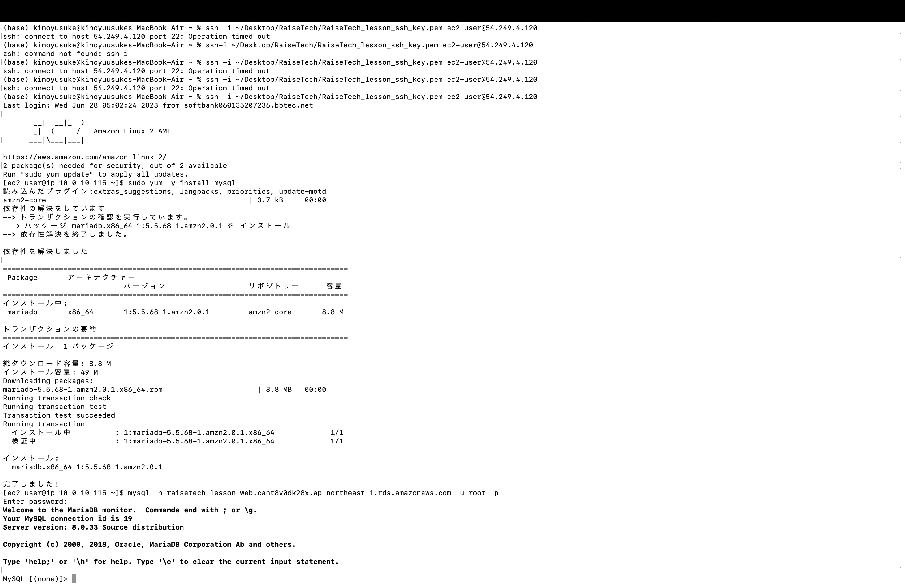

# 第4回課題で学んだこと・記録しておきたいこと

## 1. VPC作成時にやること
- VPCはIPv4「10.0.0.0/16」で作成。VPCでは、プライベートIPアドレスを使用して作成するが、**作成後は変更できないので、大きめに設定すること。「/１６」が推奨**
-  サブネットをpublic「10.0.10.0/24」とprivate「10.0.20.0/24」で作成する
-  インターネットゲートウェイ作成する
-  ルートテーブルをpublicとprivateで作成して、各々をサブネットを選んでアタッチする
-  ルートテーブルからpublicルートを選択して、publicのルートをルート編集で送信先IPv4アドレスを「0.0.0.0/0」(デフォルトルート)とインターネットゲートウェイを関連づける

## 2. EC2作成時にやること
- EC2を作成
- 名前を設定
- AMIの選択
    **(特に要件がなければ、Amazon Linuxで良い)**
- インスタンスタイプの選択 
    **(動作確認だけなら、t2.microで良い)**
+ キーペアの作成
  - 名前をつけてキーを作成して、**pemファイルをダウンロード**してデスクトップ又は任意の場所に保存する。
   (後に、EC2にSSHログインするために必要である。)  
             
+ ネットワークセッティング
  - ネットワークセッティングでは、**どのVPC内に設置するか**（今回ならRaiseTech_lesson_VPC）**どのサブネットに設置するか**（今回ならRaiseTech_public_subnet_1a）**グローバルIPアドレスは自動で作成するか**（インターネットに接続するために、Auto-assignpublicIPを有効にする必要がある）を決める
  - セキュリティーグループ、名前・接続方法を設定し（今回は、００００/０のSSH接続にする）、ネットワークインターフェイスの設定で、プライマリIPを設定する

## 3. ストレージの構成
- 汎用SSDは、価格と性能のバランスが取れており、多くの場合汎用SSDが使用されるプロビジョンドSSD、データベースなど高いIOが必要な場合に使用するマグネティックSSD、低いIOでも問題ないときに使用する
- 今回は、ボリュームタイプを汎用SSD（gp２）を使用し、サイズはデフォルト（８Gib）、暗号化はなしで作成した

- 高度な詳細
    スポットインスタンスを購入するか（常時起動しときたいなら、チェックしない）
    shutdown behaviorは、使用していないときは停止するかどうかの設定なので、今回は停止（stop）にする
    キャパシティーリザベーションは、事前にEC2インスタンスのキャパシティーを予約できるが、今回はnoneにする
    テナンシーは、シェアードにする
    インスタンス数は、起動するインスタンスの数のことで、今回は１にする
   
    
## 4. SSH接続
- ローカル環境からSSH接続する際に、先ほど作成したキーの**pemファイルをターミナルで「chmod 600 ~/Desktop/●●.pem 」で権限付与**し、**「ssh -i ~/Desktop/●●.pem ec2-user@pubulicIPv4のアドレス」** を入力し、enter後「yes」を入力する。
  ***必要なければ、必ず「exit」でEC2インスタンス（サーバー）から出ておく。***

## 5.　Apacheのインストール
+  ***sudo yum update -y***
   - EC2インスタンス（サーバー）にSSH接続する。  
   - EC2インスタンスをwebサーバーとして使用するために「yum update」を行うで
   - これはyum（Linux「サーバーのOS」のパッケージ管理ツール）で管理しているパッケージをupdateするコマンド。
   - また、ルートユーザーの権限でないと、yumを実行することができないので、sudoコマンドも併せて使用する。
   - -yはyesオプションを付けることで、コマンド実行時のyes/noの選択を一括してyesにしておく。  
  
   

+ ***sudo yum -y install httpd***
  - このコマンドでApacheがインストールされる
  - httpdがApacheを構成する実行ファイル
 
   

+ ***sudo systemctl start httpd.service***
  - Apacheを起動させるコマンド
  - 「systemctl」コマンドは、指定したサービス（アプリケーション）を起動・停止・再起動するコマンド
  - 「httpd.service」コマンドは、Apacheのこと

 

+ ***sudo systemctl status httpd.service***
  - 起動しているか確認するコマンド
  - 起動状態を確認できる「status」コマンド

 

+ ***プロセスを表示するコマンド「ps　-axu」***
  - psはLinux上で実行しているプロセスを表示するコマンド
  - axは、すべてのプロセスを表示する
  - uは、CPUやメモリ使用率を併せて表示する
  - コマンド使用後「user/sbin/httpd」があればhttpd（Apache）が起動しているということ

 

+ ***ps -axu | grep httpdのコマンド***
  - httpdを絞って表示する
  - grepは検索するコマンド（ここではhttpdを検索している）
  - 「｜」はパイプラインと言って、左側の結果を右側のコマンドに渡すコマンド

 

+ ***sudo systemctl enable httpd.service***
  - Apacheを自動起動する設定をする
  - 自動起動設定をしておかないと、Serverを一度切ると再度設定し直さないといけない

 

+ ***sudo systemctl is-enabled httpd.service***
  - 自動起動設定が出来ているか確認するコマンド
  - 「is-enabled」自動起動設定が出来ているか確認するコマンド
  - 「enabled」と表示されれば、自動起動設定が完成した、

 

## 6. ファイアウォールの設定
+ セキュリティグループの設定変更
  - 現在はインバウンドグループにポート番号２２番（SSH接続）ならどのIPアドレスでも接続可能
    

+ セキュリティグループのインバウンドルールの変更
+ HTTP接続できるように、タイプをHTTPにして、どこからでも接続できるように「0.0.0.0/0（IPv4）」にする これで、ファイアウォールを設定して、webページを表示させることが出来る
　　　

## 7. RDS
+ ### 1. RDSとは・・・
- フルマネージドなリレーショナルデータベースサービス
- 構築の手間が軽減される
- 運用の手間の軽減
- AWSエンジニアによるデータベース設計のベストプラクティスを適用
  これによりコア機能の開発に注力できる
  アプリケーションの最適化を行うだけ
　　　
+ ### 2　利用可能なエンジン
  - MySQL、PostgreSQL、Oracle、Microsoft SQL Server、Amazon Aurora、MariaDB

+ ### 3 各種設定グループ
  - DBパラメータグループ：DB設定値を制御
  - DBオプショングループ：RDSへの機能追加を制御
  - DBサブネットグループ：RDSを起動させるサブネットを制御
　　　
+ ### 4 RDSの特徴
  - 可用性を向上させることができる・・・レプリケーションして別のAZに配置し、障害が発生したときに自動的に切り替えてサービスの停止を防ぐ
  - パフォーマンスの向上・・・読み込みをリードレプリカにさせることによりデータベースの負荷を抑えることができる
  - 運用不可の軽減
    * 1日1回自動でスナップショットを取ってくれる  
    * スナップショットを元にDBインスタンスを作成できる（リストア）  
    * メンテナンスウィンドウで自動的に指定した曜日にアップデートできる
    * 監視も自動的に６０秒間隔でおこなってくれる
　　　
 
　
## 8.RDS作成時にすること

+ プライベートサブネットの作成
    - RDSを設置するためのプライベートサブネットを作成する
 
    

+ セキュリティグループの作成（EC2）
    - EC２のダッシュボードから、セキュリティグループの作成をする
    - タイプは、今回MySQL／Auroraを指定する
    - ソースは、セキュリティグループを指定することができるので、webサーバー等を指定したい場合に使用する
  
    

+ DBサブネットグループの作成
    - 名前の設定、VPCの指定、作成したサブネットを指定
    - RDSを作成する際にサブネットグループを指定すると、サブネットグループにRDSが作成される

     

+ DBパラメータグループの作成
    - パラメーターグループは、RDSではDBの設定ファイルを直接編集できないので、その代わりにDBの設定値を指定するものです
    - パラメーターグループファミリーで、DBエンジンを選択する

 

+ DBオプショングループの作成
    - 作成したらデフォルトのグループも作成されるが、変更したいときは作成したものを使用する

##  9. EC2からRDSへ接続、正常かの確認

+ ssh接続しようとしたら、先日はいけたのに今回は「timed out」の表示がされた。調べていると、サーバーを「http」接続できるようにするためにセキュリティグループのインバウンドルールを「SSH」から「http」に変更していたのが原因であった。急な現象で焦ったが、気づいたよかった。

+ ssh接続後は、MySQLのインストール「sudo yum -y install mysql」
+ インストールできたらMySQLコマンドで接続
+ エンドポイント（raisetech-lesson-web.cant8v0dk28x.ap-northeast-1.rds.amazonaws.com）を使用
+ 「mysql -h raisetech-lesson-web.cant8v0dk28x.ap-northeast-1.rds.amazonaws.com -u root -p」をターミナルで入力
+ これでwebサーバーから、DBサーバーへ接続できるようになった

以上が第4回課題をする上で学んだことである。

